# 🛒 Amazon Clone (MERN) — ShopHub

A full-stack E-Commerce web application that closely mimics the core shopping experience of **Amazon**. Built with the **MERN** stack (MongoDB, Express.js, React, Node.js) plus **Redux Toolkit**, **Redis** caching and **Razorpay** payment integration.

The application includes a customer-facing storefront (browsing, search, filters, cart, checkout, orders, reviews) and a complete **Admin Panel** (dashboard, product & order & user management).

---

## 📄 Table of Contents

- [✨ Features](#-features)
- [🧱 Tech Stack](#-tech-stack)
- [📁 Project Structure](#-project-structure)
- [🔌 API Endpoints](#-api-endpoints)
  - [Auth](#auth)
  - [Products](#products)
  - [Reviews](#reviews)
  - [Cart](#cart)
  - [Orders](#orders)
  - [Payments](#payments)
  - [Admin](#admin)
- [🛣️ Frontend Routes](#️-frontend-routes)
- [📸 Screenshots](#-screenshots)
- [🚀 Getting Started](#-getting-started)
- [🔑 Environment Variables](#-environment-variables)
- [📦 Scripts](#-scripts)
- [🧪 Seeding the Database](#-seeding-the-database)
- [🤝 Contributing](#-contributing)
- [📝 License](#-license)

---

## ✨ Features

### 👤 Customer Features
- **User Authentication** — Register (with optional avatar upload), Login, Logout, persistent JWT session.
- **Profile Management** — View / update profile and avatar, change password.
- **Password Recovery** — Forgot / reset password flow via email (Mailtrap).
- **Product Catalog** — Browse all products with a **40+ category** set.
- **Advanced Search & Filtering** — `keyword` search, category filter, **price range** filter (`price[gte]=&price[lte]=`), pagination.
- **Product Details** — Multi-image gallery, ratings, stock information, seller info.
- **Reviews & Ratings** — Users can add reviews (1–5 ⭐), per-user 24h cooldown, aggregate rating recalculated automatically.
- **Shopping Cart** — Backed by the user model: add/remove/update quantity, clear cart, stock validation, persisted in `localStorage` via Redux Persist.
- **Checkout Flow** — Shipping info → Confirm order → Payment with **Razorpay** or **Cash on Delivery (COD)**.
- **Orders** — Place orders, view own order history, view order details.
- **Order Cancellation** — Cancel a pending/shipped order (stock is restored automatically).
- **Responsive UI** — Tailwind CSS powered, mobile-first Amazon-style design with spinner/skeleton loaders.

### ⚙️ Admin Features

- **Admin Dashboard** — Real-time stats: products count, users count, orders count, total revenue, average order value, order status breakdown, top-selling products, monthly revenue charts, recent orders.
- **Product Management** — Create (with multi-image upload to Cloudinary), update, delete products.
- **User Management** — List/search/filter users, view single user, update user role (`user` / `admin` / `seller`), delete users, bulk-delete users.
- **Order Management** — View all orders, update order status (`Processing → Shipped → Delivered` / `Cancelled`), view order statistics, delete orders (stock restored).
- **User Statistics** — total users, role distribution, recent signups.

### 🏗️ Platform / Backend Features

- **Role-based access control** — `isAuthenticatedUser` + `authorizeRoles`.
- **Redis Caching** — Products, single product, orders, user lists, dashboard & order stats (~60% fewer DB hits).
- **Cloudinary Media** — Image uploads (avatars + product images, 5 MB limit).
- **Razorpay Payments** — Server-side order creation + HMAC-SHA256 signature verification + COD fallback.
- **Input Validation** — `express-validator` for order creation, order updates, user updates, bulk-delete, pagination.
- **Robust Error Handling** — Central error handler, async handler wrapper, `uncaughtException` / `unhandledRejection` shutdown handlers.
- **API Features Utility** — reusable `ApiFeatures` class that provides `search()`, `filter()`, and `pagination()`.

---

## 🧱 Tech Stack

| Layer        | Technology                                                            |
| :----------- | :-------------------------------------------------------------------- |
| **Frontend** | React 19, React Router 7, Redux Toolkit, Redux Persist, Tailwind CSS 4, Axios, Lucide React, Sonner (toasts) |
| **Backend**  | Node.js, Express 5, Mongoose 9                                          |
| **Database** | MongoDB (Atlas)                                                        |
| **Cache**    | Redis (`redis://localhost:6379`)                                       |
| **Auth**     | JSON Web Tokens (JWT) with HttpOnly + Bearer header support            |
| **Payments** | Razorpay (process + verify + COD)                                      |
| **Email**    | Nodemailer + Mailtrap (SMTP sandbox)                                   |
| **Uploads**  | Multer + Cloudinary                                                    |
| **Validation** | express-validator                                                    |
| **Styling**  | Tailwind CSS                                                           |
| **Linting**  | oxlint                                                                  |
| **Tooling**  | Vite, nodemon, cross-env                                               |

---

## 📁 Project Structure

```
amazon-clone/
├── backend/                       # Express REST API
│   ├── .env                       # Environment variables (do NOT commit)
│   ├── server.js                  # Entry point — DB connect + server bootstrap
│   ├── data.seeder.js             # CLI script to seed products into MongoDB
│   ├── uploads/                   # Temporary Multer file storage
│   └── src/
│       ├── app.js                 # Express app, CORS, middlewares, route mounting
│       ├── config/
│       │   └── database.js        # MongoDB connection
│       ├── controllers/           # Request layer (thin — delegates to services)
│       │   ├── admin.controller.js
│       │   ├── auth.controller.js
│       │   ├── cart.controller.js
│       │   ├── order.controller.js
│       │   ├── payment.controller.js
│       │   └── product.controller.js
│       ├── data/                  # Seed JSON files
│       │   ├── products.json
│       │   └── products2.json
│       ├── middleware/
│       │   ├── auth.middleware.js     # isAuthenticatedUser, authorizeRoles
│       │   └── validation.middleware.js
│       ├── models/
│       │   ├── order.model.js
│       │   ├── product.model.js
│       │   └── user.model.js          # includes cart sub-documents
│       ├── routes/
│       │   ├── admin.routes.js
│       │   ├── auth.routes.js
│       │   ├── cart.routes.js
│       │   ├── index.js
│       │   ├── order.routes.js
│       │   ├── payment.routes.js
│       │   └── product.routes.js
│       ├── services/                   # Business logic layer
│       │   ├── admin.service.js
│       │   ├── auth.service.js
│       │   ├── cart.service.js
│       │   ├── order.service.js
│       │   ├── product.service.js
│       │   ├── razorpay.service.js
│       │   └── seller.service.js
│       └── utils/
│           ├── ApiFeatures.js         # search / filter / pagination
│           ├── ErrorHandler.js
│           ├── asyncHandler.js
│           ├── cloudinaryUtils.js
│           ├── jwtToken.js            # send JWT in cookie
│           ├── redis.js               # cache helpers
│           ├── sendEmail.js           # nodemailer transporter
│           └── upload.middleware.js   # Multer config
│
├── frontend/                     # React + Vite SPA
│   ├── index.html
│   ├── vite.config.js
│   └── src/
│       ├── main.jsx
│       ├── App.jsx                   # Router definition (all routes)
│       ├── config/
│       │   └── axios.js              # Axios instance + auth interceptors
│       ├── constants/
│       │   └── amazonClasses.js
│       ├── redux/
│       │   ├── store.js              # Redux Persist (cart whitelisted)
│       │   └── slices/
│       │       ├── cartSlice.js
│       │       ├── orderSlice.js
│       │       ├── productSlice.js
│       │       └── userSlice.js
│       ├── services/
│       │   └── tokenService.js
│       ├── components/
│       │   ├── common/               # Navbar, Pagination, Error
│       │   ├── loader-skeleton/
│       │   ├── products/             # ProductCard, AmazonSpinner, Skeleton
│       │   ├── AdminSidebar.jsx
│       │   ├── CheckoutSteps.jsx
│       │   └── PaginationInfo.jsx
│       ├── page/
│       │   ├── HomePage.jsx
│       │   ├── ProductPage.jsx
│       │   ├── SearchPage.jsx
│       │   ├── CartPage.jsx
│       │   ├── LoginPage.jsx
│       │   ├── RegisterPage.jsx
│       │   ├── ShippingPage.jsx
│       │   ├── ConfirmOrderPage.jsx
│       │   ├── PaymentPage.jsx
│       │   ├── MyOrderPage.jsx
│       │   ├── OrderDetailsPage.jsx
│       │   ├── ProfilePage.jsx
│       │   └── admin/
│       │       ├── Dashboard.jsx
│       │       ├── AdminProducts.jsx
│       │       ├── AdminOrders.jsx
│       │       ├── AdminUsers.jsx
│       │       ├── NewProduct.jsx
│       │       └── UpdateProduct.jsx
│       └── assets/
│
├── screenshots/                  # Application screenshots (see § Screenshots)
└── random.js
```

> **Frontend → Backend** communication goes through the Axios instance in `frontend/src/config/axios.js`.
> **Backend base URL**: `http://localhost:4000/api/v1` (development).

---

## 🔌 API Endpoints

**Base URL:** `http://localhost:4000/api/v1`

### Auth
Mounted at `/api/v1/auth`

| Method | Endpoint                       | Auth             | Description                                          |
| :----- | :----------------------------- | :--------------- | :--------------------------------------------------- |
| POST   | `/auth/register`               | Public           | Register new user. `multipart/form-data`, optional avatar. |
| POST   | `/auth/login`                  | Public           | Login with email + password → JWT + cookie.          |
| GET    | `/auth/logout`                 | Private          | Logout (clears the JWT cookie).                      |
| POST   | `/auth/forgot-password`        | Public           | Sends password-reset email (Mailtrap).               |
| PUT    | `/auth/password/reset/:token`  | Public           | Resets password using the emailed token.             |
| GET    | `/auth/me`                     | Private          | Returns the logged-in user profile.                  |
| PUT    | `/auth/password/update`        | Private          | Checks old password & sets a new one.                |
| PUT    | `/auth/me/update`              | Private          | Updates name/email/avatar of the logged-in user.     |

<details>
<summary><b>Request examples — Auth</b></summary>

```bash
# Register (multipart/form-data)
POST http://localhost:4000/api/v1/auth/register
name=John Doe&email=john@example.com&password=123456
# (optional file field: avatar)

# Login
POST http://localhost:4000/api/v1/auth/login
{ "email": "john@example.com", "password": "123456" }

# Get my profile
GET http://localhost:4000/api/v1/auth/me
# Header: Authorization: Bearer <token>
```
</details>

### Products
Mounted at `/api/v1`

| Method | Endpoint                   | Auth          | Description                                            |
| :----- | :------------------------- | :------------ | :----------------------------------------------------- |
| GET    | `/products`                | Public        | Get all products. Supports `keyword`, `category`, `price[gte]`, `price[lte]`, `rating`, `page`, `limit`. |
| GET    | `/product/:id`             | Public        | Get a single product by ID (includes populated review avatars). |
| POST   | `/admin/product/new`       | Private/Admin | Create a product. `multipart/form-data`, up to 4 images.    |
| PUT    | `/admin/product/:id`       | Private/Admin | Update a product (fields + optional new images).       |
| DELETE | `/admin/product/:id`       | Private/Admin | Delete a product.                                     |

<details>
<summary>Query parameters — GET /products</summary>

| Query    | Example                              | Purpose                          |
| :------- | :----------------------------------- | :------------------------------- |
| keyword  | `?keyword=iphone`                    | Case-insensitive name search     |
| category | `?category=Mobile Phones`            | Filter by category               |
| price    | `?price[gte]=1000&price[lte]=20000`  | Price range (gt/gte/lt/lte)      |
| rating   | `?rating[gte]=4`                     | Minimum rating filter           |
| page     | `?page=2`                            | Pagination (10 per page)         |
| limit    | `?page=1&limit=10`                    | Custom page size                 |
</details>

### Reviews
Mounted at `/api/v1`

| Method | Endpoint        | Auth      | Description                                                       |
| :----- | :-------------- | :-------- | :---------------------------------------------------------------- |
| PUT    | `/review`       | Private   | Create / update a review. Body: `productId`, `rating` (1–5), `comment`. 24h cooldown per review. |
| DELETE | `/review`       | Private   | Delete a review. Query params: `productId`, `id` (review id).      |
| GET    | `/reviews`      | Public    | Get all reviews of a product. Query param `?id=<productId>`.       |

### Cart
Mounted at `/api/v1/cart`

| Method | Endpoint           | Auth    | Description                                        |
| :----- | :----------------- | :------ | :------------------------------------------------- |
| GET    | `/cart`            | Private | Get current user's cart (populated + subtotals/totals). |
| POST   | `/cart/:productId` | Private | Add a product to cart. Body: `{ quantity }`.       |
| PUT    | `/cart/:productId` | Private | Update quantity of a cart item.                    |
| DELETE | `/cart/:productId` | Private | Remove a specific item from the cart.              |
| DELETE | `/cart`            | Private | Clear the entire cart.                             |
| GET    | `/cart/stock`      | Private | Check stock availability of all cart items.        |

### Orders
Mounted at `/api/v1`

| Method | Endpoint               | Auth      | Description                                                      |
| :----- | :--------------------- | :---------| :--------------------------------------------------------------- |
| POST   | `/order/new`           | Private   | Create a new order. Validates items, shipping info; reduces stock. Auto-computes tax (18%) & shipping (free over ₹1000). |
| GET    | `/order/:id`           | Private   | Get single order (admin can view any order). Returns `fromCache` flag. |
| GET    | `/orders/me`           | Private   | Get current user's orders (paginated, `?page=` & `?limit=`, `?status=` filter). |
| PUT    | `/order/:id/cancel`    | Private   | Cancel own order (restores stock).                               |
| GET    | `/admin/orders`        | Admin     | Get all orders (filters `?status=`, `?startDate=&endDate=`, `?search=`) + stats. |
| PUT    | `/admin/order/:id`     | Admin     | Update order status (`Processing`/`Shipped`/`Delivered`/`Cancelled`). |
| DELETE | `/admin/order/:id`     | Admin     | Delete an order (restores stock if not delivered/cancelled). |
| GET    | `/admin/orders/stats`  | Admin     | Get statistics: per-status breakdown, monthly revenue, recent orders. |

<details>
<summary>Order status state machine</summary>

```
Processing → Shipped, Cancelled
Shipped    → Delivered, Cancelled
Delivered  → (final)
Cancelled  → (final)
```
</details>

### Payments
Mounted at `/api/v1/payment`

| Method | Endpoint              | Auth | Description                                                          |
| :----- | :-------------------- | :--- | :------------------------------------------------------------------- |
| POST   | `/payment/process`    | Private | Create a Razorpay order. Body: `{ amount, method }`. If `method === "cod"`, returns a mock pending payment. Otherwise returns `key_id` + `order_id` to open the Razorpay modal. |
| POST   | `/payment/verify`     | Private | Verify Razorpay signature (`razorpay_order_id`, `razorpay_payment_id`, `razorpay_signature`) and mark payment `succeeded`. |
| GET    | `/payment/config`     | Public  | Get the Razorpay `key_id` (used by the frontend checkout).        |

> **Payment flow**: frontend calls `/payment/process` → opens Razorpay checkout with returned `key_id`/`order_id` → on success calls `/payment/verify` → then creates the order via `/orders/new` with the returned `paymentInfo`.

### Admin
Mounted at `/api/v1/admin` — **all admin routes require `isAuthenticatedUser` + `authorizeRoles("admin")`**.

| Method | Endpoint                | Description                                              |
| :----- | :---------------------- | :------------------------------------------------------- |
| GET    | `/admin/stats`          | Dashboard stats (counts, revenue, status breakdown, top products, monthly stats). |
| GET    | `/admin/users`          | List all users. Query: `?page=`, `?limit=`, `?search=`, `?role=`. |
| GET    | `/admin/user/:id`       | Get single user details.                                 |
| PUT    | `/admin/user/:id`       | Update user (name/email/role). Valid roles: `user`, `admin`, `seller`. |
| DELETE | `/admin/user/:id`       | Delete a user (cannot delete your own account).          |
| DELETE | `/admin/users/bulk`     | Bulk-delete users. Body: `{ "userIds": [ ... ] }`.       |
| GET    | `/admin/user-stats`     | User statistics: total users, role distribution, recent signups. |

---

## 🖣️ Frontend Routes

Defined in `src/App.jsx` (React Router v7, `BrowserRouter`).

| Route                    | Page / Component        | Access  | Description                              |
| :----------------------- | :---------------------- | :------ | :--------------------------------------- |
| `/`                      | `HomePage`              | Public  | Landing page with featured product sections. |
| `/product/:id`           | `ProductPage`           | Public  | Product detail (images, price, stock, reviews, add-to-cart). |
| `/search`                | `SearchPage`            | Public  | Search results with category/price filters & pagination. |
| `/login`                 | `LoginPage`             | Public  | Login form.                               |
| `/register`              | `RegisterPage`          | Public  | Registration form (name, email, password, avatar). |
| `/cart`                  | `CartPage`              | Private | Cart items, quantity controls, subtotal & checkout button. |
| `/shipping`              | `ShippingPage`          | Private | Shipping address form. Checkout step 1.   |
| `/order/confirm`         | `ConfirmOrderPage`      | Private | Review items, address & payment summary. Checkout step 2. |
| `/payment/process`       | `PaymentPage`           | Private | Payment method picker (Razorpay / COD) + Razorpay checkout. Checkout step 3. |
| `/orders/me`             | `MyOrderPage`           | Private | Current user's order history (pagination).|
| `/order/:id`             | `OrderDetailsPage`      | Private | Full order details incl. shipping & payment info. |
| `/profile`               | `ProfilePage`           | Private | View/edit profile, update password, avatar. |
| `/admin/dashboard`       | `Dashboard`             | Admin   | Admin stats dashboard.                    |
| `/admin/products`        | `AdminProducts`         | Admin   | List, create/update/delete products.      |
| `/admin/product/new`     | `UpdateProduct`         | Admin   | Create a new product.                     |
| `/admin/product/:id`     | `UpdateProduct`         | Admin   | Edit an existing product.                 |
| `/admin/users`           | `AdminUsers`            | Admin   | Manage users & roles, delete users.       |
| `/admin/orders`          | `AdminOrders`           | Admin   | Manage orders, update status, delete.     |

> **Authentication strategy** — the token is stored in `localStorage` + an HTTP-only cookie; the Axios interceptor adds the `Authorization: Bearer` header automatically, and on `401` clears storage and redirects to `/login`.

---

## 📄 Screenshots

All screenshots live in the `screenshots/` folder.

| Screenshot                        | Description                           |
| :-------------------------------- | :------------------------------------ |
| 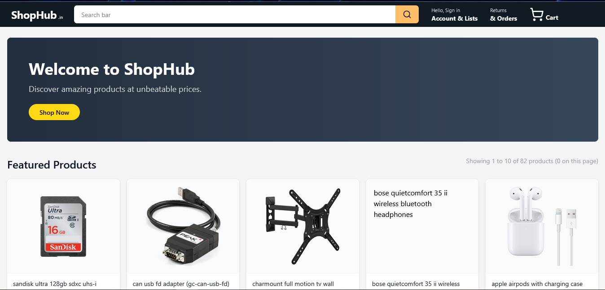 | Home page hero banner.                |
|  | Featured product items section.       |
| 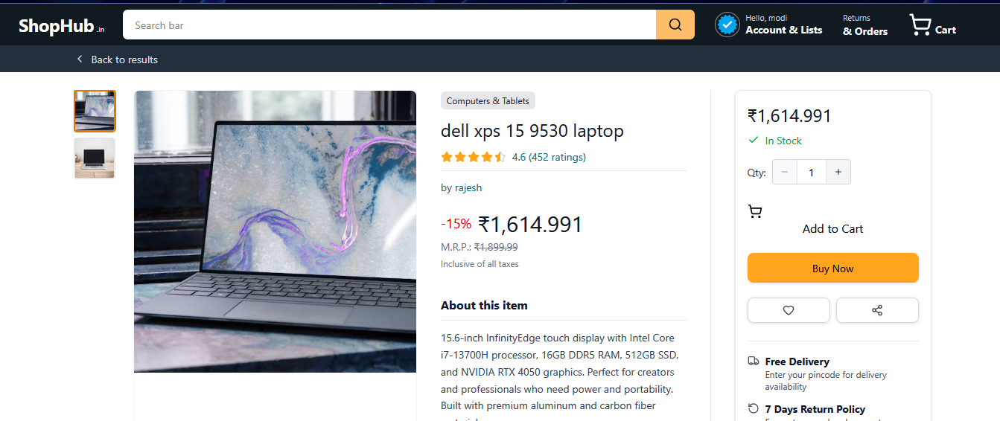 | Product detail page with reviews.     |
| 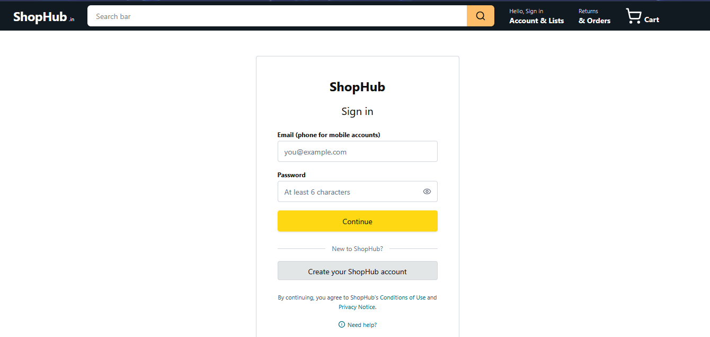 | User login screen.                    |
| 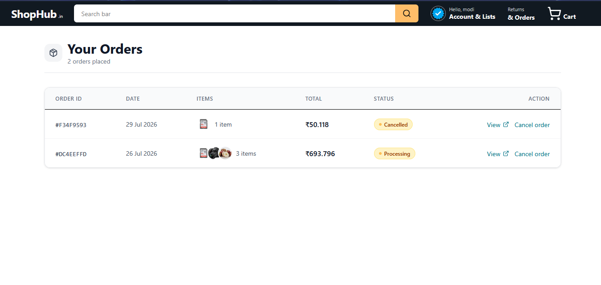 | My Orders list page.                  |
| 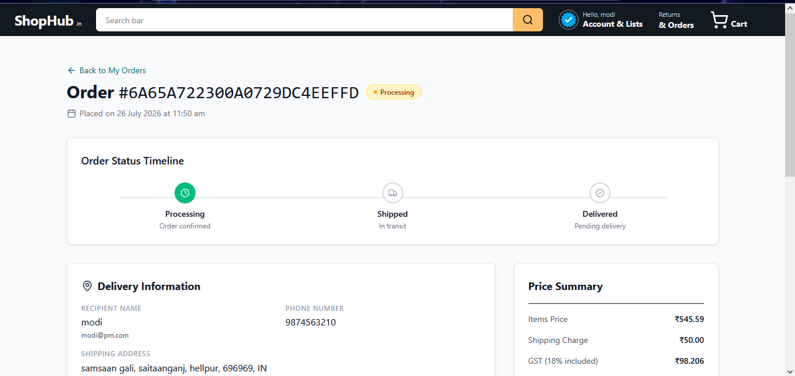 | Order detail / status view.           |
| 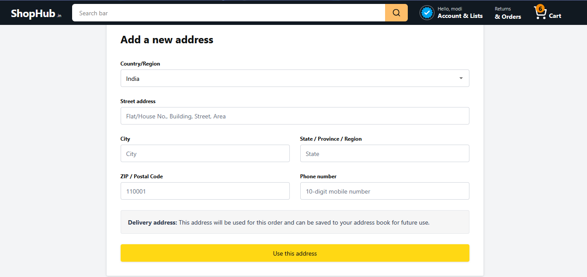 | Shipping address checkout step.       |
| 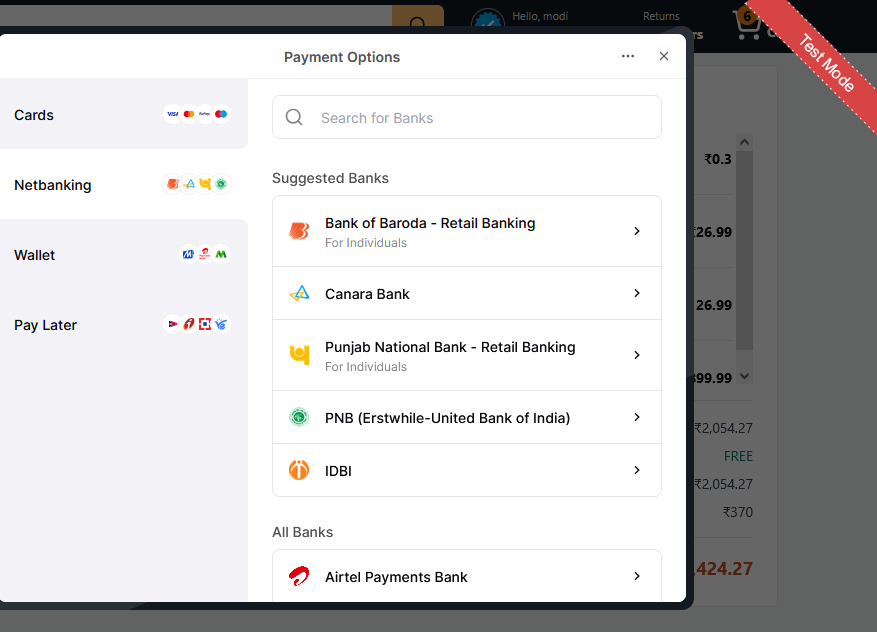 | Available payment methods.            |
| 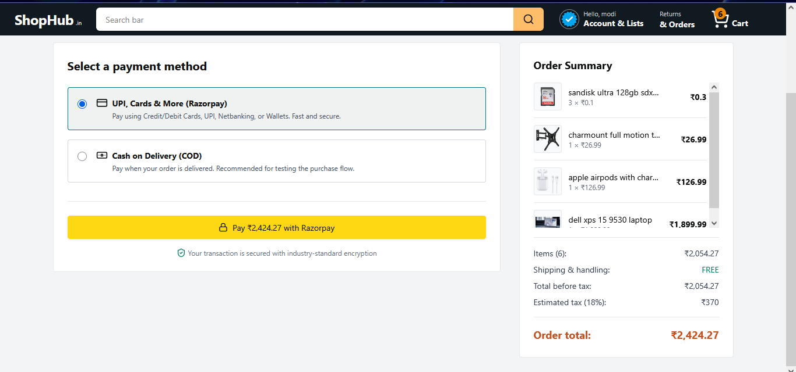 | Payment method selection.             |
| 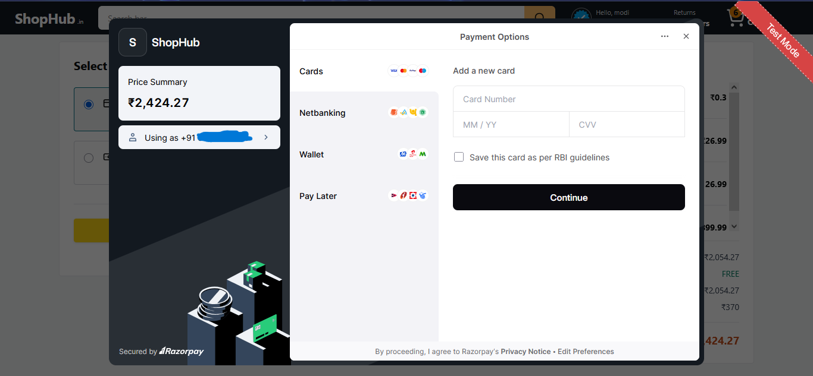 | Payment & amount summary.             |
| 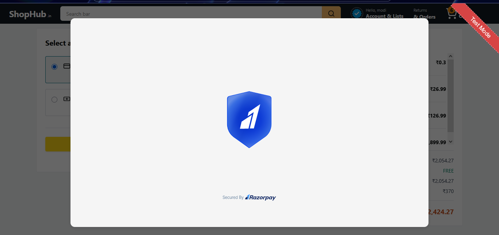 | Razorpay checkout intro.              |
| 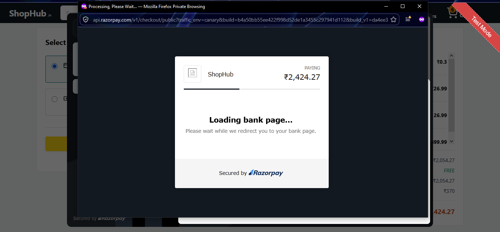 | Razorpay checkout loading state.      |
| 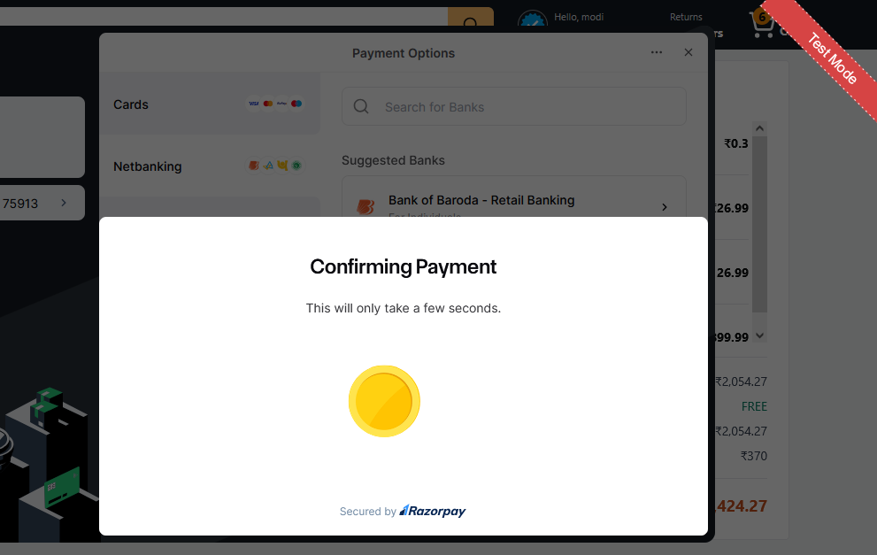 | Payment confirmation in progress.     |
| 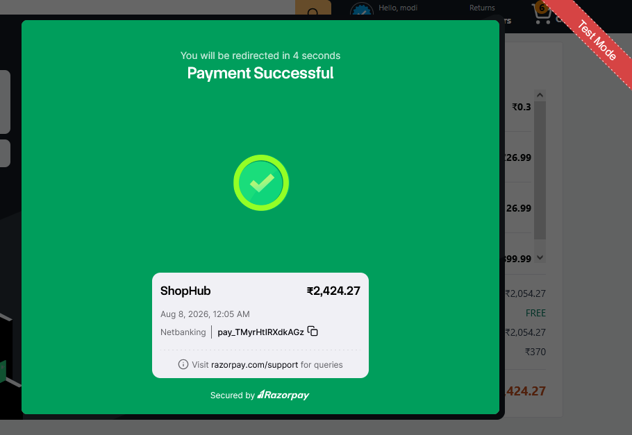 | Successful payment badge.             |
| 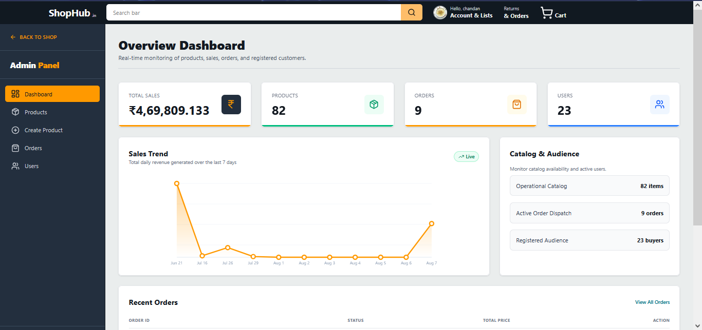 | Admin analytics dashboard.             |

*(If the images do not render above, open the files directly in the `screenshots/` directory.)*

---

## 🚀 Getting Started

### Prerequisites

- **Node.js** ≥ 18
- **npm** or **yarn**
- **MongoDB** — Atlas (or local instance)
- **Redis** — running locally at `redis://localhost:6379`
- Accounts for **Cloudinary**, **Razorpay (test mode)** and **Mailtrap**

### 1. Clone the repository

```bash
git clone https://github.com/ChandanKSDeveloper/Amazon-clone.git
cd amazon-clone
```

### 2. Backend setup

```bash
cd backend
npm install
```

Copy `.env.example` → `.env` (create the file if not present) and fill in the values (see [Environment Variables](#-environment-variables)):

```bash
cp .env.example .env   # Windows:  copy .env.example .env
```

Make sure **Redis** and **MongoDB** are running, then:

```bash
npm run dev
```

The API will start at `http://localhost:4000`.

### 3. Frontend setup

In a new terminal:

```bash
cd frontend
npm install
```

Create `frontend/.env` (optional — falls back to `http://localhost:4000/api/v1`):

```bash
VITE_API_URL=http://localhost:4000/api/v1
```

Then:

```bash
npm run dev
```

The app will open at `http://localhost:5173`.

### 4. Seed sample products (optional)

```bash
cd backend
node data.seeder.js
```

---

## 🔑 Environment Variables

### Backend — `backend/.env`

Create a `.env` file in the `backend/` folder with the following keys (do **NOT** commit real values):

```ini
# SERVER
PORT=4000
NODE_ENV=DEVELOPMENT

# CORS - allowed frontend origins
FRONTEND_URL=http://localhost:5173
FRONTEND_PROD_URL=https://your-production-frontend.com

# MONGODB
MONGODB_URL=mongodb://127.0.0.1:27017   # or your Atlas connection string
DB_NAME= my_amazon_clone

# JWT
JWT_SECRET=your_super_secret_key
JWT_EXPIRES_IN=7d

# COOKIE
COOKIE_EXPIRES_IN=7

# CLOUDINARY
CLOUDINARY_CLOUD_NAME=your_cloud_name
CLOUDINARY_API_KEY=your_api_key
CLOUDINARY_API_SECRET=your_api_secret

# MAILTRAP (SMTP for password reset emails)
MAILTRAP_HOST=sandbox.smtp.mailtrap.io
MAILTRAP_PORT=2525
MAILTRAP_USER=your_mailtrap_user
MAILTRAP_PASS=your_mailtrap_pass
MAILTRAP_TOKEN=your_mailtrap_token
MAILTRAP_FROM_NAME="E-Commerce Support"
MAILTRAP_FROM_EMAIL="hello@demomailtrap.co"

# REDIS
REDIS_URL=redis://localhost:6379
REDIS_CACHE_EXPIRATION=300

# RAZORPAY (test keys)
RAZORPAY_KEY_ID=rzp_test_your_key_id
RAZORPAY_KEY_SECRET=your_key_secret
```

| Variable | Required | Description |
| :------- | :------- | :---------- |
| `PORT` | Yes | Port on which the backend runs (default `4000`) |
| `NODE_ENV` | Yes | `DEVELOPMENT` or `PRODUCTION` |
| `FRONTEND_URL` / `FRONTEND_PROD_URL` | Yes | Allowed CORS origins |
| `MONGODB_URL` | Yes | MongoDB connection string |
| `DB_NAME` | Yes | Database name (appended to `MONGODB_URL`) |
| `JWT_SECRET` | Yes | Secret used to sign JWT tokens |
| `JWT_EXPIRES_IN` | No | Token expiry (default `7d`) |
| `COOKIE_EXPIRES_IN` | No | Cookie TTL in days (default `7`) |
| `CLOUDINARY_CLOUD_NAME` etc. | Yes* | Avatar and product image uploads |
| `MAILTRAP_*` | Yes* | SMTP for password-reset emails |
| `REDIS_URL` | Yes* | Redis connection URL |
| `RAZORPAY_KEY_ID` / `RAZORPAY_KEY_SECRET` | Yes* | Razorpay payment gateway |

> `*` The app will still boot without these but the related feature will fail. Payment falls back to COD when Razorpay keys are missing.

### Frontend — `frontend/.env.production`

```env
VITE_API_URL=https://your-production-api.com/api/v1
```

---

## 📦 Scripts

### Backend (`backend/package.json`)

| Script | Command                            | Description                                          |
| :----- | :--------------------------------- | :--------------------------------------------------- |
| `dev`  | `cross-env NODE_ENV=DEVELOPMENT nodemon server.js` | Run with auto-restart & debug logging (dev mode).     |
| `start` | `node server.js`                 | Run in production mode (`NODE_ENV=PRODUCTION`).       |
| `prod` | `cross-env NODE_ENV=PRODUCTION node server.js` | Run in production env explicitly.                     |
| `seed` | `node data.seeder.js` (manual)    | Insert sample products into MongoDB.                 |

### Frontend (`frontend/package.json`)

| Script     | Command            | Purpose                               |
| :--------- | :----------------- | :------------------------------------ |
| `dev`      | `vite`              | Start Vite dev server (`:5173`).     |
| `build`    | `vite build`        | Build the production bundle.          |
| `preview`  | `vite preview`      | Preview built output.                |
| `lint`     | `oxlint`            | Lint the frontend code.               |

---

## 🧠 Seeding the Database

Sample product data ships in `backend/src/data/products.json` and `backend/src/data/products2.json`.

```bash
cd backend
node data.seeder.js
```

The script connects to MongoDB and `insertMany`s the products:
- `Add products deleted` line is commented out — uncomment `await Product.deleteMany()` to re-seed cleanly.

---

## 🤝 Contributing

1. Fork the repo & create a feature branch.
2. Make your changes and run `npm run lint` in the frontend.
3. Open a Pull Request with a clear description.

---

## 📝 License

This project is for **educational purposes only** and is not affiliated with or endorsed by Amazon (or Razorpay). Use of any Amazon-like design assets is the responsibility of the user.

Built with ❤️ by **Chandan Kumar Singh**.
